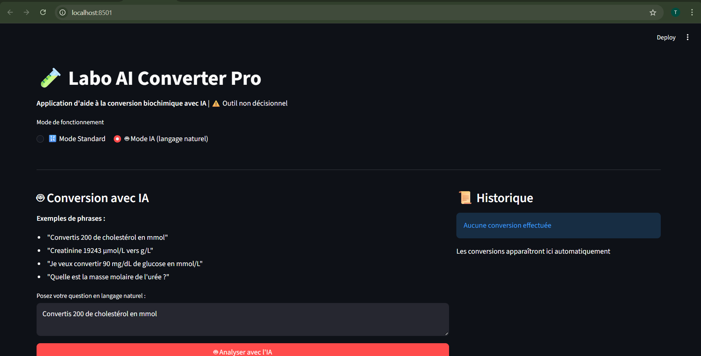
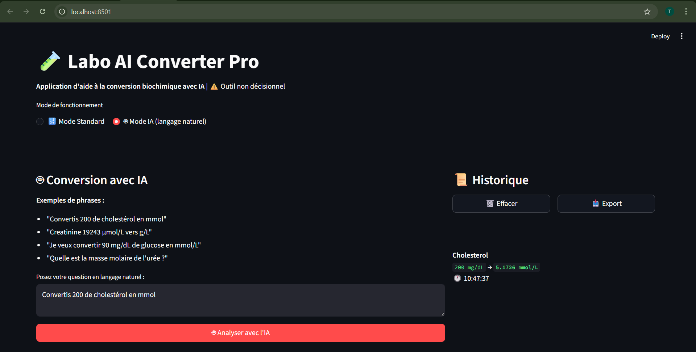

# 🧪 Labo AI Converter Pro

**Professional Biochemical Unit Conversion Application with Local AI Integration**

[](https://www.python.org/)
[](https://streamlit.io/)
[](https://ollama.com/)
[](LICENSE)

---

## 📋 Table of Contents

- [Overview](#overview)
- [Key Features](#key-features)
- [🤖 AI Features](#-ai-features)
- [Scientific Foundation](#scientific-foundation)
- [Technology Stack](#technology-stack)
- [Installation](#installation)
- [Usage](#usage)
- [Screenshots](#screenshots)
- [Project Structure](#project-structure)
- [Future Developments](#future-developments)
- [Author](#author)

---

## 🎯 Overview

**Labo AI Converter Pro** is a local AI-powered application designed for clinical biochemistry laboratories to automate and standardize unit conversions between different measurement systems.

This project addresses a critical need in medical laboratories: **reducing human error in biochemical unit conversions** while maintaining full compliance with ISO 15189 quality standards and ensuring complete data privacy through local AI processing.

### 🏥 Context

In clinical laboratories, biochemical results are reported in various units (µmol/L, mmol/L, mg/dL, g/L) depending on regional standards and laboratory equipment. Manual conversions are time-consuming and error-prone. This application provides:

- ✅ **Automated multi-unit conversions** based on validated molar masses
- ✅ **Natural language processing** via local LLM (no data sent online)
- ✅ **Traceability** through calculation history and CSV export
- ✅ **Offline operation** for complete data security compliance
- ✅ **Quality assurance** aligned with ISO 15189 principles

---

## ✨ Key Features

### 🔬 Multi-Analyte Support
- Creatinine
- Urea
- Glucose
- Cholesterol
- Triglycerides
- Bilirubin
- Uric Acid

### 🔄 Intelligent Unit Conversion
Supports conversion between:
- **µmol/L** (micromoles per liter)
- **mmol/L** (millimoles per liter)
- **mg/dL** (milligrams per deciliter)
- **g/L** (grams per liter)

Conversion algorithm uses **mol/L as intermediate unit** for maximum accuracy.

### 📊 Calculation History
- Automatic timestamp recording
- Session-based storage (last 50 conversions)
- CSV export for quality control documentation

### 🛡️ Quality & Compliance
- Source attribution (PubChem - NIH)
- Molar mass validation
- Non-decisional tool disclaimer (ISO 15189)
- Calculation transparency
- 100% offline AI processing (data never leaves your machine)

---

## 🤖 AI Features

### Dual-Mode Interface

The application offers two operational modes:

#### 🔢 Standard Mode
Traditional interface with dropdown menus and manual input:
- Select analyte from list
- Enter numerical value
- Choose source and target units
- Calculate with one click

#### 🤖 AI Mode (Natural Language Processing)
Revolutionary conversational interface powered by **Ollama + Llama 3.2**:
- Input requests in natural language
- Automatic entity extraction (analyte, value, units)
- Intelligent context understanding
- Instant conversion results

### Natural Language Examples

The AI understands various phrasings:

```
✅ "Convertis 200 de cholestérol en mmol"
   → Detects: cholesterol, 200, mg/dL → mmol/L

✅ "Creatinine 19243 µmol/L vers g/L"
   → Detects: creatinine, 19243, µmol/L → g/L

✅ "Je veux convertir 90 mg/dL de glucose en mmol/L"
   → Detects: glucose, 90, mg/dL → mmol/L

✅ "Quelle est la masse molaire de l'urée ?"
   → Responds: 60.06 g/mol (PubChem NIH)
```

### AI Architecture

```
User Input (Natural Language)
    ↓
Ollama (Llama 3.2 - Local LLM)
    ↓
JSON Entity Extraction
    ├─ Analyte identification
    ├─ Numerical value
    ├─ Source unit
    └─ Target unit
    ↓
Conversion Engine
    ↓
Result + Explanation
```

### Privacy & Security

🔒 **100% Offline Processing**
- Ollama runs entirely on your local machine
- No data sent to external servers
- No API keys required
- GDPR compliant
- Patient data remains secure

### Technical Implementation

- **LLM**: Llama 3.2 (via Ollama)
- **Prompt Engineering**: Structured JSON extraction
- **Entity Recognition**: Analyte, value, units
- **Fallback Handling**: Graceful degradation if AI unavailable
- **Response Parsing**: Robust JSON handling with error recovery

---

## 🔬 Scientific Foundation

All molar mass values are sourced from **PubChem** (National Institutes of Health):

| Analyte | Molar Mass (g/mol) | Source |
|---------|-------------------|--------|
| Creatinine | 113.12 | [PubChem CID 588](https://pubchem.ncbi.nlm.nih.gov/compound/588) |
| Urea | 60.06 | [PubChem CID 1176](https://pubchem.ncbi.nlm.nih.gov/compound/1176) |
| Glucose | 180.16 | [PubChem CID 5793](https://pubchem.ncbi.nlm.nih.gov/compound/5793) |
| Cholesterol | 386.65 | [PubChem CID 5997](https://pubchem.ncbi.nlm.nih.gov/compound/5997) |
| Triglycerides | 885.43 | Average molecular weight |
| Bilirubin | 584.66 | [PubChem CID 5280352](https://pubchem.ncbi.nlm.nih.gov/compound/5280352) |
| Uric Acid | 168.11 | [PubChem CID 1175](https://pubchem.ncbi.nlm.nih.gov/compound/1175) |

### Conversion Formula

```
mol/L = (value × unit_factor) / molar_mass
result = mol/L × target_unit_factor × molar_mass
```

**Example: Cholesterol 200 mg/dL → mmol/L**
1. Convert to g/L: 200 mg/dL = 2.0 g/L
2. Convert to mol/L: 2.0 / 386.65 = 0.00517 mol/L
3. Convert to mmol/L: 0.00517 × 1000 = 5.17 mmol/L ✅

---

## 🛠️ Technology Stack

### Core Technologies
- **Python 3.11+** - Core programming language
- **Streamlit** - Web application framework
- **Pandas** - Data manipulation and CSV handling
- **Ollama** - Local LLM inference engine
- **Llama 3.2** - Large Language Model (3B parameters)

### AI/ML Components
- **Natural Language Processing** - Entity extraction from unstructured text
- **Prompt Engineering** - Structured JSON output generation
- **Local Inference** - No external API dependencies

### Why These Technologies?

- **Streamlit**: Rapid development, professional UI, easy deployment
- **Ollama**: Best-in-class local LLM runtime, easy installation, no API costs
- **Llama 3.2**: Efficient, accurate, multilingual capabilities
- **Local-first**: No external API dependencies, data remains secure
- **Pandas**: Industry standard for data processing in scientific computing

---

## 📦 Installation

### Prerequisites

- Python 3.10 or higher
- pip (Python package manager)
- Ollama (for AI features)

### Step-by-Step Installation

#### 1. Install Ollama

**Windows:**
```bash
# Download from https://ollama.com/download
# Run OllamaSetup.exe
# Ollama will start automatically
```

**Mac:**
```bash
brew install ollama
ollama serve
```

**Linux:**
```bash
curl -fsSL https://ollama.com/install.sh | sh
```

#### 2. Download AI Model

```bash
ollama pull llama3.2
```

#### 3. Clone the Repository

```bash
git clone https://github.com/TakoiRizgui/labo-ai-converter.git
cd labo-ai-converter
```

#### 4. Create Virtual Environment

```bash
python -m venv venv
```

#### 5. Activate Virtual Environment

**Windows:**
```bash
venv\Scripts\activate
```

**Mac/Linux:**
```bash
source venv/bin/activate
```

#### 6. Install Dependencies

```bash
pip install -r requirements.txt
```

#### 7. Run the Application

```bash
streamlit run app.py
```

The application will open automatically in your browser at `http://localhost:8501`

---

## 🚀 Usage

### Basic Workflow - Standard Mode

1. **Select analyte** from dropdown menu
2. **Enter measured value**
3. **Choose origin unit**
4. **Choose target unit**
5. **Click "Convert"** to see results

### AI Mode - Natural Language

1. **Select "🤖 Mode IA (langage naturel)"**
2. **Type your request** in natural language
3. **Click "🤖 Analyser avec l'IA"**
4. **View detection** and automatic conversion

### Example Conversions

**Standard Mode Example:**
- Analyte: Creatinine
- Input: 19243 µmol/L
- Output: 2.1767 g/L

**AI Mode Examples:**
```
Input: "Convertis 200 de cholestérol en mmol"
Output: 5.1726 mmol/L

Input: "Glucose 90 mg/dL vers mmol/L"
Output: 4.9956 mmol/L

Input: "Quelle est la masse molaire de la créatinine ?"
Output: 113.12 g/mol (PubChem NIH)
```

### Exporting History

Click the **"📥 Export"** button to download calculation history as CSV for quality control documentation.

---

## 📸 Screenshots

### Standard Mode Interface

*Professional interface with dropdown menus for precise conversions*

### AI Mode - Natural Language Input

*Conversational interface accepting natural language requests*

### AI Mode - Intelligent Results

*Automatic entity detection and instant conversion with source attribution*

---

## 📁 Project Structure

```
Labo_AI_App/
├── app.py                      # Main application with AI integration
├── scientific_data.csv         # Molar mass database
├── requirements.txt            # Python dependencies
├── README.md                   # This file
├── TECHNICAL_DOC.md           # Technical documentation
├── screenshots/               # Application screenshots
│   ├── screenshot1.png
│   ├── mode_ia.png
│   └── resultat.png
└── venv/                      # Virtual environment (not committed)
```

---

## 🔮 Future Developments

### Phase 1: Enhanced AI Capabilities (Planned)
- Multi-turn conversation support
- Context retention across queries
- Batch conversion mode via natural language
- Uncertainty estimation in AI predictions

### Phase 2: Extended Features
- Additional analytes (electrolytes, enzymes, hormones)
- Reference ranges integration
- PDF report generation with QR code traceability
- Multi-language support (French, English, Arabic)

### Phase 3: Deployment & Integration
- Docker containerization
- Internal lab network deployment
- LIMS (Laboratory Information Management System) integration
- REST API for programmatic access
- User authentication for audit trails

### Phase 4: Advanced Analytics
- Conversion pattern analysis
- Usage statistics dashboard
- Quality control metrics
- Anomaly detection

---

## 🎓 Academic Context

This project was developed as part of a professional reconversion from clinical biology to data science and artificial intelligence. It demonstrates:

### Domain Expertise
- Deep understanding of clinical laboratory workflows
- Knowledge of biochemistry and analytical methods
- Awareness of quality management systems (ISO 15189)

### Technical Skills
- **Backend**: Python, data structures, algorithms
- **Frontend**: Streamlit, UI/UX design
- **AI/ML**: LLM integration, prompt engineering, NLP
- **Data Engineering**: CSV processing, data validation
- **DevOps**: Git, version control, documentation

### Skills Demonstrated

- ✅ Scientific data validation and verification
- ✅ Natural language processing implementation
- ✅ Local AI deployment and optimization
- ✅ User interface design for domain experts
- ✅ Software architecture and modularity
- ✅ Quality assurance principles
- ✅ Technical documentation and communication
- ✅ Privacy-first application design

---

## 👩‍🔬 Author

**Takoi Rizgui**
- 🔬 Background: Medical Laboratory Technician
- 🤖 Transition: Data Science & Artificial Intelligence
- 🎯 Goal: Master's program in AI/Data Science (Europe)
- 🌍 Location: Tunis, Tunisia
- 🐙 GitHub: [TakoiRizgui](https://github.com/TakoiRizgui)

### Professional Journey

Transitioning from clinical laboratory work to AI/Data Science, combining:
- 5+ years hands-on experience in medical laboratories
- Deep understanding of healthcare data workflows
- Strong foundation in biochemistry and analytical methods
- Emerging expertise in AI, machine learning, and software development

This project bridges domain expertise with cutting-edge AI technology, demonstrating the ability to identify real-world problems and design practical AI solutions while maintaining data security and quality standards.

---

## 📄 License

This project is licensed under the MIT License - see the [LICENSE](LICENSE) file for details.

---

## ⚠️ Disclaimer

**This application is a non-decisional support tool.**

It is designed to assist laboratory professionals in performing unit conversions but does not replace professional judgment or validated laboratory information systems. All results should be verified according to your laboratory's quality management system and ISO 15189 requirements.

**AI Limitations:**
- Natural language understanding may vary with phrasing
- Always verify AI-extracted values against source input
- AI mode is complementary to standard mode, not a replacement
- For critical decisions, use standard mode with manual verification

---

## 🙏 Acknowledgments

- **PubChem (NIH)** for validated scientific data
- **Ollama Team** for outstanding local LLM infrastructure
- **Meta AI** for Llama 3.2 model
- **Streamlit** community for excellent documentation
- Clinical laboratory colleagues for requirements validation and testing

---

## 📞 Support & Contact

For questions, suggestions, or collaboration inquiries:
- 🐛 **Report Issues**: [GitHub Issues](https://github.com/TakoiRizgui/labo-ai-converter/issues)
- 💬 **Discussions**: [GitHub Discussions](https://github.com/TakoiRizgui/labo-ai-converter/discussions)
- 📧 **Email**: [Contact via GitHub profile]

---

## 🌟 Star History

If you find this project useful, please consider giving it a ⭐ on GitHub!

---

**Built with ❤️ for the clinical laboratory community**

*Combining medical expertise with artificial intelligence for safer, more efficient healthcare*
